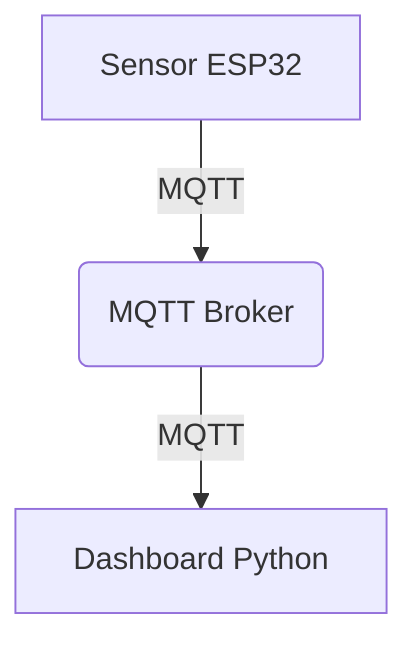

# Sistem Monitoring Sensor ESP32 dengan MQTT & Dashboard Python

<p align="center">
	
</p>

## Gambaran Umum
Proyek ini adalah solusi IoT lengkap untuk pemantauan data sensor secara real-time dari perangkat ESP32. Sistem menggunakan protokol MQTT untuk transmisi data yang efisien dan dilengkapi dashboard Python modern untuk visualisasi serta analisis data.

## Diagram Arsitektur
Berikut adalah diagram sederhana alur data sistem:



## Contoh Data Sensor
Data sensor dikirim dalam format JSON, misalnya:
```json
{
	"device_id": "esp32-01",
	"temperature": 27.5,
	"humidity": 60,
	"timestamp": "2025-10-25T10:00:00Z"
}
```

## Teknologi yang Digunakan
- **Python 3.12**
- **MQTT** (menggunakan `paho-mqtt`)
- **Dashboard UI:** Tkinter/Streamlit (sesuaikan dengan implementasi)
- **JSON** untuk format data

## Dokumentasi & Referensi
- [Protokol MQTT](https://mqtt.org/)
- [Paho MQTT Python Client](https://www.eclipse.org/paho/index.php?page=clients/python/index.php)


## Fitur
- **Streaming Data Real-time:** Sensor ESP32 mengirim data ke server melalui MQTT.
- **Dashboard Python:** UI interaktif untuk visualisasi data secara langsung dan analisis historis.
- **Desain Modular:** Pemisahan jelas antara client MQTT, UI dashboard, dan fungsi utilitas.
- **Integrasi Mudah:** Siap dihubungkan dengan berbagai sensor dan dapat dikembangkan untuk lebih banyak perangkat.
- **Ekspor Data:** Ekspor data sensor untuk pemrosesan lanjutan atau pelaporan.

## Struktur Folder
- `main.py` — Program utama sistem.
- `esp32-sensor.py` — Simulasi data sensor ESP32.
- `mqtt/` — Implementasi client MQTT.
- `dashboard/` — Kode UI dashboard.
- `utils/` — Modul utilitas (logging, ekspor, dll).
- `test-data-sender.py` — Skrip pengujian pengiriman data.

## Cara Memulai
1. **Instal dependensi:**
	```bash
	pip install -r requirements.txt
	```
2. **Jalankan sistem utama:**
	```bash
	python main.py
	```
3. **Tes pengirim data (opsional):**
	```bash
	python test-data-sender.py
	```

## Contoh Penggunaan
- Monitoring rumah pintar
- Jaringan sensor industri
- Pencatatan data lingkungan
- Proyek IoT edukasi

## Screenshot
_Tambahkan screenshot dashboard Anda di sini agar README lebih menarik!_

## FAQ & Troubleshooting
**T: Mengapa dashboard tidak menampilkan data?**
- Pastikan ESP32 dan broker MQTT berjalan.
- Cek koneksi jaringan dan konfigurasi broker di `config.json`.

**T: Bagaimana cara menambah sensor baru?**
- Tambahkan perangkat baru pada ESP32 dan sesuaikan topic MQTT di kode Python.

**T: Data tidak terkirim ke broker?**
- Periksa apakah broker MQTT aktif dan port sudah benar.

**T: Bagaimana cara ekspor data?**
- Gunakan fitur ekspor pada dashboard atau modul `utils/exporter.py`.

## Kontribusi
- Pull request sangat diterima! Silakan ajukan saran perbaikan atau fitur baru.
- Salman Alfauzi Asngari | 23106050013

## Lisensi
MIT License